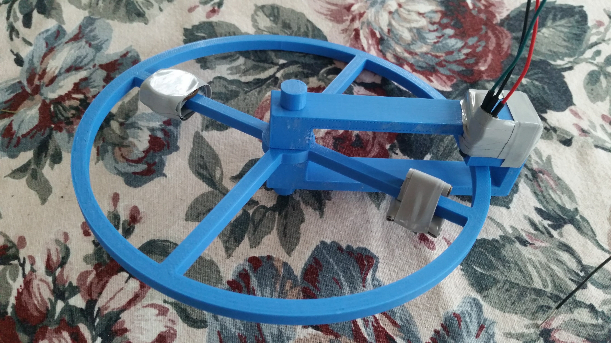
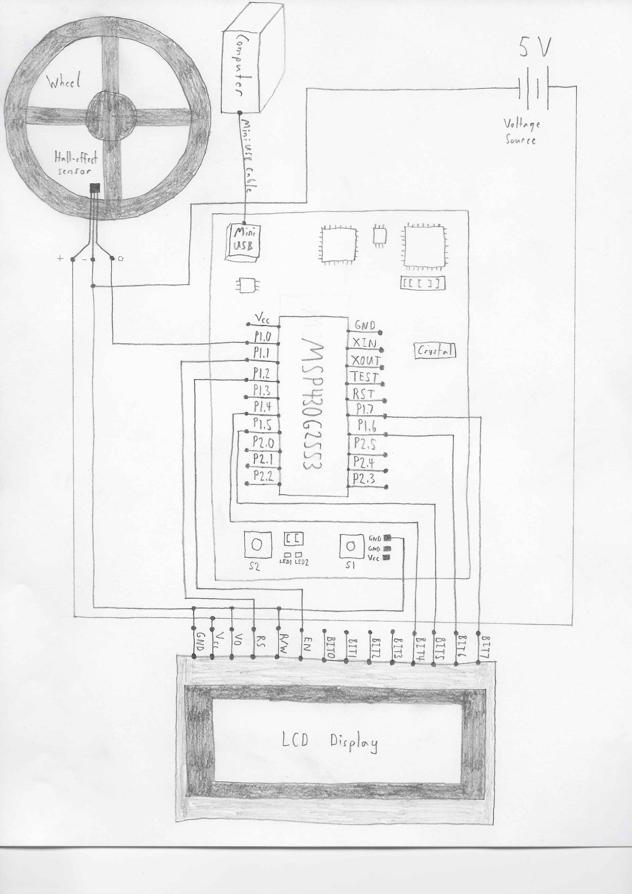

# Speedometer-and-Odometer-v6
This is an MSP430-related project.

## Parts List
1. Computer with Code Composer Installed
1. Mini USB Cable
1. MSP430G2553 with External 32.768 kHz Crystal Clock Source Installed
1. SS49E/SS59ET Series Economical Linear Hall-effect Sensor
1. Magnet
1. Hitachi HD44780 LCD Display
1. Breadboard
1. Wires
1. 3D Printed Wheel Parts
1. 3 Pennies and 1 Dime

## Tools List
1. Soldering Pen
1. 3D Printer
1. Electrical Tape
1. Gorilla Glue
1. Voltage Source (Power Supply or 3 AA Batteries in Series)
1. Voltmeter

## General Concept
To measure the speed of a bike, it’s necessary to measure the period of each wheel revolution of the bike. In conjunction with the wheel circumference value, it’s possible to calculate speed, since all that’s necessary is a change in distance and a change in time. To measure the period, a magnet and a linear hall effect sensor is used. As the magnet passes the sensor, it causes the output voltage of the sensor to shift (can be high or low depending on the polarity of the magnet). The MSP430G2553 has an analog-to-digital converter, which allows the microcontroller to sample the output voltage from the sensor and convert that value to a digital one. This digital value is then used in code to determine when the magnet is either on top of the sensor or not. Every time the sensor detects the magnet, a timer, after being configured within the microcontroller, is started and stopped. The value that is counted to, once the timer stops, contains the period. Using simple math to convert to the preferred units of speed, the speed is calculated. This speed is then sent to the LCD display to be viewed, along with trip information, like distance (a value is incremented by the circumference of the bike wheel every revolution) and max speed (compared to current speed, and if lower, max speed is updated to reflect the new higher speed).

## Basic Overview of the LCD Display
The Hitachi HD44780 LCD display used in this project has a 4x20 (4 rows and 20 columns) display. To use this LCD display, the code in this project includes an LCD display library, which was written by Kates Gasis and posted to Github for use with the MSP430, specifically. This library is designed to work in 4-bit mode. This means that there are four data lines to send commands and data across. To use 4-bit mode, the initialize function in this library sends commands to the LCD display to enable 4-bit mode. For sending commands and data (characters), the send function is used. The send function sends the MSB nibble of the data first, then after a short delay, it sends the LSB nibble. Other functions, such as the write line function and go to line function, which use the send function, provide the ability to write characters on the specified line to the display.

## Maximum Operating Profile (Fastest the Wheel Can Turn)
Using an oscilloscope, and setting and resetting a bit before and after the ADC interrupt code, it’s possible to measure the time required to sample for the magnet spinning on the wheel. The time taken inside of the ADC interrupt code is 3.0 micro seconds. The time taken outside of the ADC interrupt code is 68.7 micro seconds. Combining these values, we find the total time to sample once for the magnet is 71.7 micro seconds. Converting to frequency, we have 13,947.0 Hz. To ensure that the magnet is detected, it’s necessary to sample more than once. Sampling three times is sufficient to detect the magnet, so the frequency drops to 4,649.0 Hz. This speedometer, with the 16 in. circumference wheel, can handle up to 4,649 rotations per second. The maximum speed to expect from this smaller wheel is 999 in/s, which equates to (999 in / s / 16 in) 62.4 rotations per second. This is well under the limit, and the sampling rate of the ADC will have no trouble keeping up with the fastest this wheel will ever spin.

## Flowchart

# Instructions
1. Print wheel parts from the provided STL files.
1. Solder on wires (~18 in.) to the leads of the hall-effect sensor. With the flat side of the hall-effect sensor placed on a flat surface with the leads facing towards you, power is on the left, ground is in the middle, and signal is on the right.
1. Assemble the wheel, along with the other non-3D printed parts (hall-effect sensor, magnet, pennies and dime), according to Figure 1. You will need glue and tape. Note: Before attaching the hall-effect sensor to the MSP430G2553, use the voltmeter to check that the voltage drops when the magnet is positioned above the magnet and when the hall-effect sensor is not positioned above the magnet, the voltage is not above 3.3 V. If the voltage exceeds 3.3 V, make a voltage divider to remedy this.
1. Open Code Composer and make a new CCS project. Make sure the target device is correct (MSP430G2553), and you choose the empty project with the main.c template. Then, copy and paste the main.c code from Figure 3 to the main.c file in the project. Finally, make a lcd_config.h header file, lcd.h header file, and lcd.c source file, and copy over the appropriate code from Figures 4-6 to those respective files.
1. Connect each of the components together as shown in Figure 2.
1. Run the program with Code Composer.
1. You should have a proof of concept bicycle speedometer with trip information running. On the LCD display, the top number is current speed, middle number is trip distance, and bottom number is max speed. Speed is in in/s and distance is in inches. For a practical application, the units of speed would be changed to mi/hr and the units of distance would be changed to miles.

## 3D Printed Bike Wheel w/ Hall Effect Sensor Mount

## Schematic

